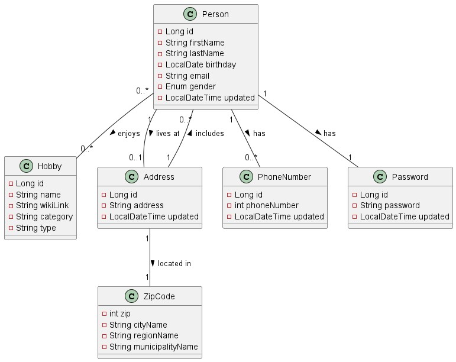

"The business idea is to create a platform that not only provides information 
about people and their hobbies but also offers a matchmaking service. 
Users can input their hobbies and interests, and the platform can connect 
them with like-minded individuals or groups in their local area. 
This would add a social networking element to the service and encourage 
people to explore new hobbies together, fostering real-world connections."

Domain Model:

EER Diagram

Group Work: 
We help each other over discord and in person, by asking questions, 
but mainly we worked by ourselves.

Technical Requirements:
    [R-1] The project must include the following technologies
        JPA
        JPQL
        Java Streams API
        Java Generics
        Maven
        JDK 17^
        JUnit 5
        Docker
        PostgresSQL
        pgAdmin
        Lombok
    [R-2] The project must contain a meaningful EER-diagram (use pgAdmin to create the diagram)
    [R-3] The project must be documented in a README.md file(*)
    [R-4] The project must contain meaningful unit tests. (70 - 80 % of the methods must be tested (DAO, Entity ...))
    [R-5] JPA annotations must be used for mapping domain classes
    [R-6] JPQL must be used for some CRUD operations
    [R-7] JPA annotations must include minimum once an @Enumerated, @PrePersist and @PreUpdate.
    [R-8] DAO must make use of java generics so we can use the DAO on different data types.
    [R-9] All date/time properties must be made with java.time.LocalDate, java.time.Date or java.time.LocalDateTime and not just a String
    [R-10] DAO classes should follow the Singleton Pattern
    [R-11] Make filter methods on one or more DAO classes to use for searching on location, age, hobbies or name (E.g. find all people with last name = "Hansson")

